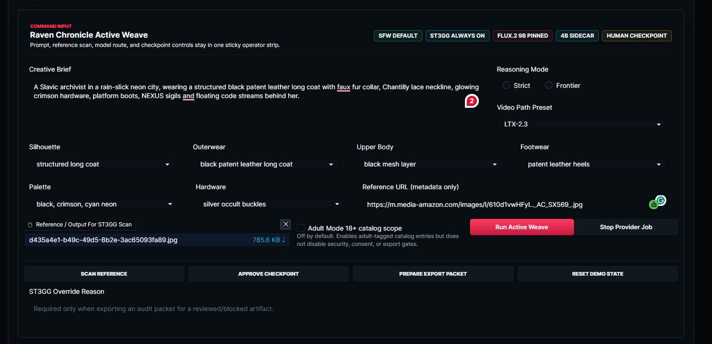
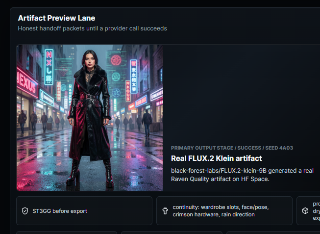
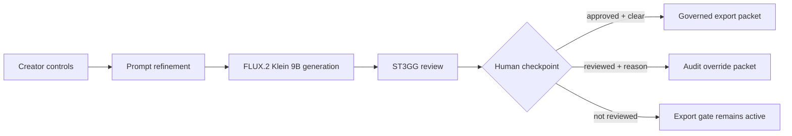
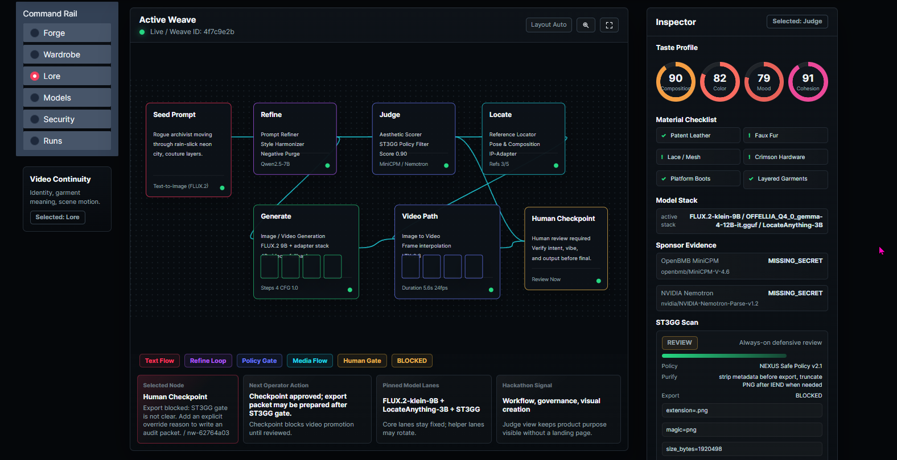
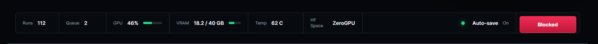
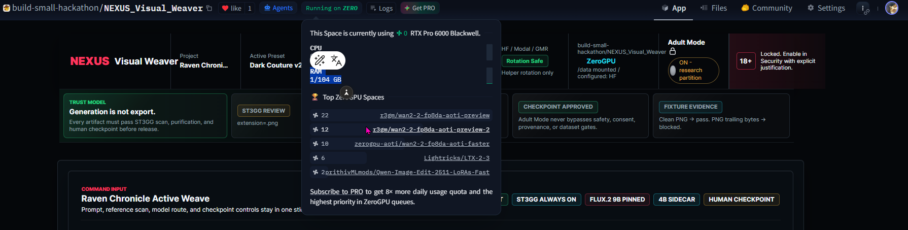
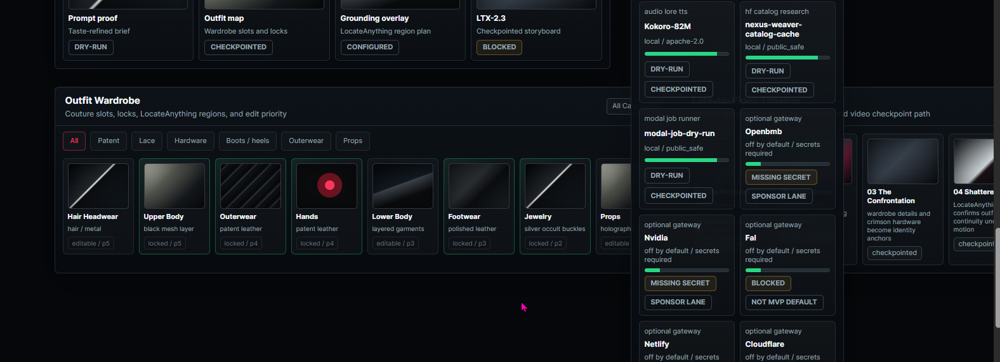
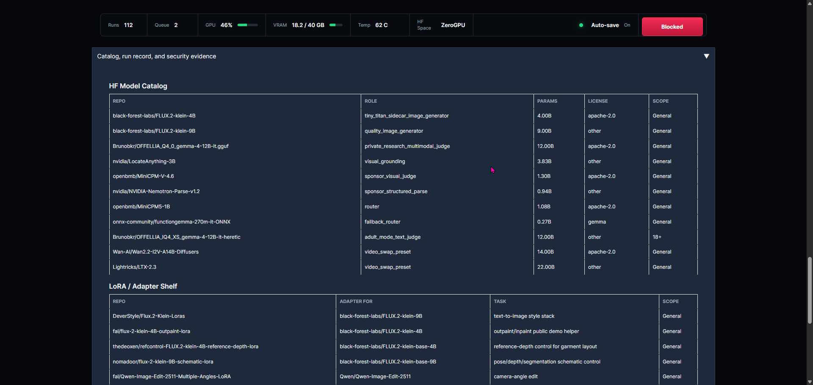

---
title: NEXUS Visual Weaver
emoji: 🧵
colorFrom: red
colorTo: gray
sdk: gradio
sdk_version: 6.12.0
app_file: app.py
pinned: false
license: apache-2.0
short_description: Governed gothic couture visual creation command center
models:
  - black-forest-labs/FLUX.2-klein-9B
  - black-forest-labs/FLUX.2-klein-4B
  - nvidia/LocateAnything-3B
  - openbmb/MiniCPM-V-4.6
  - nvidia/NVIDIA-Nemotron-Parse-v1.2
tags:
  - gradio
  - mcp-server
  - build-small
  - visual-creation
  - hackathon
  - off-brand
  - best-agent
  - best-demo
  - openbmb
  - codex
---

# NEXUS Visual Weaver


https://github.com/user-attachments/assets/3d8a6c2e-f6d8-4b2d-8fa7-d488fb86afa0


**Raven Chronicle** is a governed high-fashion visual creation command center.

> Real generation. Visible governance. Auditable output.


**Live Space:** [build-small-hackathon/NEXUS_Visual_Weaver](https://huggingface.co/spaces/build-small-hackathon/NEXUS_Visual_Weaver)

NEXUS Visual Weaver is built for creative work where the image is only part of the deliverable. A weave run carries the prompt, wardrobe controls, model route, ST3GG scan, checkpoint state, and export evidence together so the operator can prove what happened.

## Live Command Surface



The first screen is the working surface: creative brief, outfit controls, reference metadata, ST3GG input, model route, checkpoint controls, and the **Run Active Weave** action stay together.

## Real Usage & Evidence




| Evidence | Current status |
| --- | --- |
| Real FLUX.2 Klein 9B artifact | Verified in the live Space screenshot |
| Creator controls | Visible in the command surface and persisted into run evidence |
| ST3GG scan | Active before export |
| Human checkpoint | Required before release |
| Export gate | Blocks release until review or audit override |
| Tests | 288 passing locally |
| Secret scan | Clean |
| Runtime | ZeroGPU / RTX Pro 6000 Blackwell |
| Deployment evidence | Space SHA `621cf5d992e74c0d756ff0e5042a43f1fcab346d`; GitHub main `06114ab` |


No sponsor or video lane is claimed as successful unless the export packet proves it. Missing-secret and gated states stay visible by design.

## How a Governed Weave Works





The graph and inspector make the state visible: generation can succeed while export remains gated. That is intentional.

## Governance Model

**Generation is not export.**

Every artifact must pass defensive review and human checkpoint before release. Adult Mode is opt-in and partitioned; it never disables safety, consent, provenance, dataset, or export gates.

The export packet is the source of truth. It records:

- creator controls and wardrobe slots
- model and LoRA status
- reference metadata and hashes
- generated artifact basename
- ST3GG verdict and override reason when used
- checkpoint and provider states

## Runtime Proof





The public Space is running on ZeroGPU with RTX Pro 6000 Blackwell visible in the live runtime panel. The footer telemetry is operational evidence, not a marketing mockup. When the status says the export gate is active, the app is protecting release rather than failing generation.

## Model Governance

Pinned lanes do not rotate:

| Lane | Model | Role |
| --- | --- | --- |
| Image generation | `black-forest-labs/FLUX.2-klein-9B` | Raven Quality primary image lane |
| Sidecar / Tiny Titan evidence | `black-forest-labs/FLUX.2-klein-4B` | Fallback and 4B sidecar |
| Grounding | `nvidia/LocateAnything-3B` | Region and visual grounding anchor |
| Security / export review | ST3GG adapter | Defensive scan, purification, export gate |


Optional lanes are first-class but gated:

| Lane | Status rule |
| --- | --- |
| OpenBMB MiniCPM-V | Claimed only when a configured provider returns success in an export packet |
| NVIDIA Nemotron | Claimed only when a configured provider returns success in an export packet |
| LTX-2.3 video path | Gated behind checkpoint and review in this sprint |
| Modal / external jobs | Deferred unless configured and proven by runtime evidence |

## Current Scope: Gated, Not Claimed

This sprint focuses on governed image creation and export evidence. Video rendering and external sponsor judges remain gated behind human review and secrets. The interface shows those states openly instead of pretending that missing-secret or deferred lanes succeeded.


## Verification

```powershell
python -m compileall app.py src tests
$env:PYTEST_DISABLE_PLUGIN_AUTOLOAD='1'
python -m pytest -q tests -p no:cacheprovider --basetemp=C:\tmp\pytest-nvw-full
git grep -n -I -E "hf_[A-Za-z0-9]{20,}|Bearer [A-Za-z0-9._-]+|sk-[A-Za-z0-9_-]{20,}|api[_-]?key\s*=" -- .
```

Latest local verification: **288 tests passing**, compile clean, tracked-file secret scan clean. The live Space root and `/gradio_api/info` returned HTTP 200 after deployment.

## Wardrobe, Catalog, And Evidence Surfaces





The wardrobe and catalog surfaces are included as evidence of the real operating model: couture slots, material locks, model roles, adapter shelf, and parameter-budget visibility.


## Build Small Prize Mapping

| Target | Evidence status |
| --- | --- |
| Gradio Space | Public Hugging Face Gradio Space with `mcp_server=True`. |
| <=32B models | Active stack remains under the 32B ceiling and is visible in the UI. |
| Off Brand | Gothic couture command center with workflow graph, wardrobe drawer, ST3GG trust strip, and live artifact evidence. |
| Best Agent | Multi-step weave: prompt refinement, generation, scan, optional judges, checkpoint, and governed export. |
| OpenBMB | Conditional; claimed only when MiniCPM-V returns `success` in an export packet. |
| NVIDIA | Conditional; claimed only when Nemotron returns `success`; LocateAnything remains grounding evidence. |
| OpenAI Codex | Development and review work performed through Codex-authored implementation commits. |
| Demo / social | Add final links here before submission: `DEMO_VIDEO_URL` and `SOCIAL_POST_URL`. |

## Merit Badges

| Badge | Bonus Quest | Status | Evidence |
| --- | --- | --- | --- |
| `off-brand` | Off-Brand | Ready | Gothic couture command-center UI with workflow graph, inspector, wardrobe/lore drawer, and ST3GG trust strip. |
| `best-agent` | Best Agent | Ready when export packet exists | Multi-step weave: prompt refinement, generation, scan, optional judges, checkpoint, and governed export. |
| `best-demo` | Best Demo | Pending final asset | Requires final demo video link and social post link before submission. |
| `openbmb` | OpenBMB sponsor | Conditional | Claimed only when MiniCPM-V returns `success` in an export packet. |
| `nvidia` | NVIDIA/Nemotron sponsor | Conditional | Claimed only when Nemotron returns `success`; LocateAnything remains grounding evidence, not a Nemotron claim. |


## Local Setup

```powershell
python -m pip install -r requirements.txt
$env:NEXUS_DISABLE_REAL_HF='1'
python app.py
```

The app reads `NEXUS_PORT` or `PORT` when present, otherwise it launches on `7860`.

## Secret Policy

Do not commit provider credentials. Use Hugging Face Space secrets or local `.env` files for provider keys.

Generated outputs, local moodboards, logs, caches, auth folders, and preview artifacts are intentionally ignored.

## Review Workflow

- Bootstrap commit establishes the public GitHub repository baseline.
- Future substantial changes should use `codex/specimba/<scope>` branches and draft pull requests.
- GitHub Actions runs compile and pytest.
- CodeRabbit is configured to focus review on Gradio runtime correctness, model governance, security gates, Adult Mode behavior, and regression coverage.

See [docs/RELEASE_WORKFLOW.md](docs/RELEASE_WORKFLOW.md) for the push and review gate.

## License

Apache-2.0. See [LICENSE](LICENSE).
